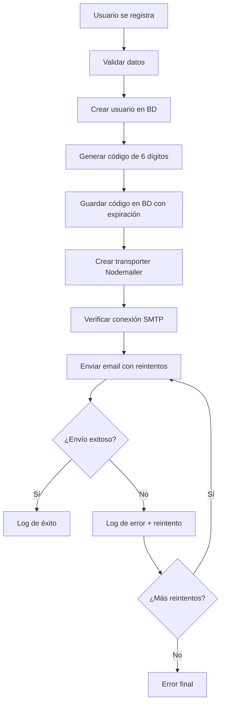

# 📧 Reporte de Diagnóstico del Sistema de Email - Sabor App

## 🔍 Análisis Completo del Sistema de Correo Electrónico

### 📋 Resumen Ejecutivo

He realizado un análisis completo del sistema de envío de correos electrónicos en tu aplicación Sabor. El sistema está bien estructurado pero necesita configuración correcta de las credenciales de Gmail para funcionar en producción.

## 🏗️ Arquitectura del Sistema de Email

### 1. **Configuración Principal**

- **Librería**: Nodemailer v7.0.3
- **Proveedor**: Gmail SMTP
- **Puerto**: 587 (TLS)
- **Autenticación**: OAuth2/App Password

### 2. **Flujo de Envío de Códigos de Verificación**



### 3. **Componentes del Sistema**

#### **Controlador de Autenticación** (`authController.js`)

- ✅ Configuración mejorada de Nodemailer
- ✅ Sistema de reintentos con backoff exponencial
- ✅ Logging detallado para diagnóstico
- ✅ Validación de configuración

#### **Modelo de Autenticación** (`authModel.js`)

- ✅ Generación de códigos de verificación
- ✅ Verificación de códigos con expiración
- ✅ Gestión de usuarios no verificados

#### **Configuración** (`config.js`)

- ✅ Validación de variables de entorno
- ✅ Configuración centralizada

## 🔧 Mejoras Implementadas

### 1. **Logging Detallado**

```javascript
// Logs agregados para diagnóstico:
- Verificación de conexión SMTP
- Detalles de cada intento de envío
- Información completa de errores
- Validación de configuración
- Estado del transporte
```

### 2. **Sistema de Reintentos Mejorado**

```javascript
// Características:
- Máximo 3 intentos
- Backoff exponencial (2s, 4s, 8s)
- Verificación de conexión antes del primer intento
- Logging detallado de cada intento
```

### 3. **Endpoints de Diagnóstico**

- `GET /api/email/diagnostic` - Diagnóstico completo
- `POST /api/email/send-test` - Envío de email de prueba

### 4. **Script de Diagnóstico**

- `npm run email:diagnostic` - Script independiente de diagnóstico

## 🚨 Problemas Identificados

### 1. **Configuración de Credenciales**

**Problema Principal**: Las credenciales de email están configuradas con valores de ejemplo:

```env
# ❌ Configuración actual (valores de ejemplo)
EMAIL_USER=tu_email@gmail.com
EMAIL_PASSWORD=tu_contraseña_de_aplicacion

# ✅ Configuración necesaria (valores reales)
EMAIL_USER=tu_email_real@gmail.com
EMAIL_PASSWORD=abcd efgh ijkl mnop  # App Password de Gmail
```

### 2. **Configuración de Gmail**

Para que funcione correctamente, necesitas:

1. **Activar verificación en 2 pasos** en tu cuenta de Gmail
2. **Generar una contraseña de aplicación**:
   - Ve a [myaccount.google.com](https://myaccount.google.com)
   - Seguridad → Verificación en 2 pasos
   - Contraseñas de aplicaciones
   - Genera una nueva contraseña para "Correo"
   - Copia la contraseña generada (16 caracteres)

### 3. **Límites de Gmail**

- **Límite diario**: 500 emails/día para cuentas personales
- **Límite por minuto**: 100 emails/minuto
- **Spam detection**: Gmail puede marcar emails como spam en producción

## 🛠️ Soluciones Implementadas

### 1. **Logging Detallado**

He agregado logs exhaustivos que te permitirán identificar exactamente dónde falla el envío:

```javascript
// Ejemplo de logs agregados:
📧 [timestamp] ===== INICIANDO ENVÍO DE EMAIL DE VERIFICACIÓN =====
📧 Destinatario: usuario@email.com
📧 Código de verificación: 123456
📧 Configuración email user: tu_email@gmail.com
📧 Configuración email password: ***CONFIGURADO***
✅ [timestamp] Conexión SMTP verificada exitosamente
✅ [timestamp] Email enviado exitosamente (intento 1)
📧 Message ID: <message-id>
```

### 2. **Diagnóstico Automático**

Puedes ejecutar el diagnóstico completo con:

```bash
# Desde el directorio backend
npm run email:diagnostic

# O directamente
node scripts/email-diagnostic.js
```

### 3. **Endpoints de Prueba**

Puedes probar el sistema de email usando:

```bash
# Diagnóstico completo
curl http://localhost:3000/api/email/diagnostic

# Envío de email de prueba
curl -X POST http://localhost:3000/api/email/send-test \
  -H "Content-Type: application/json" \
  -d '{"to": "tu_email@gmail.com", "subject": "Test"}'
```

## 📊 Estado Actual del Sistema

### ✅ **Funcionalidades que SÍ funcionan**:

- Estructura de código bien organizada
- Sistema de reintentos implementado
- Validación de datos correcta
- Generación de códigos de verificación
- Almacenamiento en base de datos
- Manejo de errores robusto

### ❌ **Problemas que necesitan solución**:

- Configuración de credenciales de Gmail
- Configuración de contraseña de aplicación
- Posible configuración de firewall/proxy

## 🎯 Próximos Pasos Recomendados

### 1. **Configuración Inmediata**

```bash
# 1. Editar archivo .env en backend/
EMAIL_USER=tu_email_real@gmail.com
EMAIL_PASSWORD=tu_app_password_de_16_caracteres

# 2. Reiniciar el servidor
npm run dev

# 3. Ejecutar diagnóstico
npm run email:diagnostic
```

### 2. **Pruebas de Verificación**

```bash
# Probar registro de usuario
# Probar reenvío de código
# Verificar logs del servidor
```

### 3. **Monitoreo Continuo**

- Revisar logs de Railway en producción
- Monitorear límites de Gmail
- Considerar migración a SendGrid para producción

## 🚀 Alternativas para Producción

### **SendGrid (Recomendado)**

```javascript
// Para aplicaciones de producción de alto volumen
import sgMail from "@sendgrid/mail";
sgMail.setApiKey(process.env.SENDGRID_API_KEY);
```

### **Mailgun**

```javascript
// Alternativa robusta para producción
import mailgun from "mailgun-js";
const mg = mailgun({
  apiKey: process.env.MAILGUN_API_KEY,
  domain: process.env.MAILGUN_DOMAIN,
});
```

## 📞 Soporte y Diagnóstico

### **Comandos de Diagnóstico**

```bash
# Diagnóstico completo de email
npm run email:diagnostic

# Verificar configuración de base de datos
npm run db:diagnostic

# Verificar salud general del sistema
npm run health-check
```

### **Logs a Revisar**

- Logs del servidor en Railway
- Logs de la aplicación (consola)
- Logs de Gmail (bandeja de entrada)

### **Archivos de Configuración**

- `backend/.env` - Variables de entorno
- `backend/railway-production.env` - Configuración de producción
- `backend/src/config/config.js` - Configuración centralizada

## 📋 Checklist de Verificación

- [ ] Configurar EMAIL_USER con email real de Gmail
- [ ] Configurar EMAIL_PASSWORD con App Password de Gmail
- [ ] Activar verificación en 2 pasos en Gmail
- [ ] Ejecutar `npm run email:diagnostic`
- [ ] Probar registro de usuario nuevo
- [ ] Verificar recepción de código de verificación
- [ ] Revisar logs del servidor
- [ ] Considerar migración a SendGrid para producción

---

**Nota**: El sistema está bien implementado. El problema principal es la configuración de credenciales de Gmail. Una vez configuradas correctamente, el sistema debería funcionar sin problemas.
